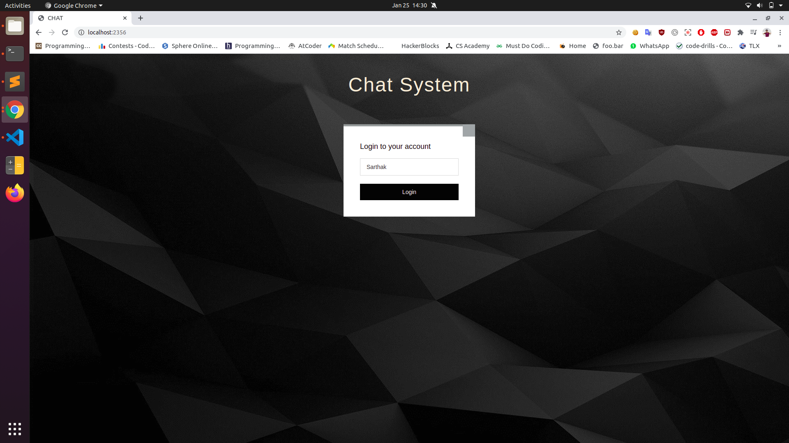
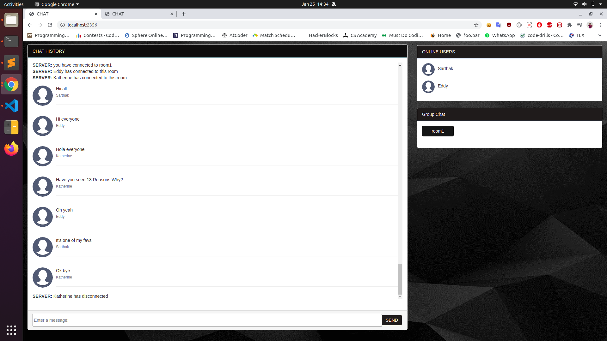

# Get-Connected
A real time chatting application.
This web app is built using Node.js, Express, Socket.io, MongoDB and RESTful web services.

# Features
  <li>Uses Express as the application Framework.</li> 
  <li>Real-time communication between a client and a server using Socket.io.</li>
  <li>Uses MongoDB, Mongoose  for storing messages and querying data.</li>
  <li>Uses RESTful web service for serve different platforms</li> 

# Installation

### Running locally
Make sure you have Node.js and npm installed.
    1. Clone or Download the repository.
        <pre>git clone https://github.com/sarthakeddy/Get-Connected.git
        cd Get-Connected</pre>
    2. Install dependencies
        <pre>npm install</pre>
    3. Start MongoDB
        <pre>sudo systemctl start mongod</pre>
    4. Start the web application.
        <pre>node run.js</pre>
    5. Application runs at port 2356. Open the application at 
        <pre>http://localhost:2356/</pre>

## Screenshots

## Get in touch

